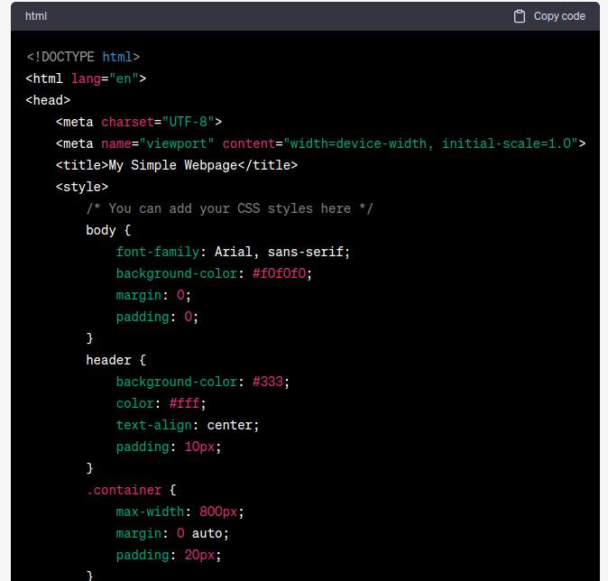
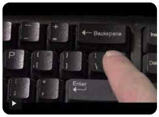

# Writing Good Documentation

When you can, always provide a codeblock instead of a screenshot.
If you need to take a screenshot, make sure that it isn't a photo you took with your smartphone.

> There are certain cases where it's okay to take photos with your smartphone.  This is when you're showing something like a keyboard, which doesn't appear on a computer screen.  If it's rendered on your computer, it should be a screenshot.

## Step 1 - How to take screenshots

A screenshot is when you capture a part of your screen from your laptop, desktop or phone.

This isn't to be confused with taking a photo with your smartphone.

**DON'T DO THIS**


This is what a screenshot from your computer should look like:

**DO THIS INSTEAD**



Taking screenshots on both macOS (formerly known as Mac OS X) and Windows is relatively straightforward. Each operating system provides built-in tools and keyboard shortcuts for capturing screenshots.

**Taking Screenshots on macOS:**

macOS offers several built-in options for taking screenshots:

1. **Capture Entire Screen:**
   - Press `Shift` + `Command` + `3`.
   - The screenshot is saved as a file on your desktop by default.

2. **Capture a Specific Portion of the Screen:**
   - Press `Shift` + `Command` + `4`.
   - Drag to select the portion of the screen you want to capture.
   - The screenshot is saved as a file on your desktop.

3. **Capture a Specific Window:**
   - Press `Shift` + `Command` + `4`.
   - Press the `Spacebar`.
   - Click on the window you want to capture.
   - The screenshot is saved as a file on your desktop.

4. **Capture the Touch Bar (if applicable):**
   - Press `Shift` + `Command` + `6`.
   - The screenshot is saved as a file on your desktop.

You can also use the "Grab" application (found in the "Utilities" folder within the "Applications" folder) for more advanced screenshot options.

**Taking Screenshots on Windows:**

Windows provides various methods for taking screenshots, depending on your version of Windows:

1. **Capture Entire Screen:**
   - Press the `PrtScn` (Print Screen) key.
   - The screenshot is copied to your clipboard. You can paste it into an image editor (e.g., Paint) and save it.

   OR

   - Press `Windows` + `Shift` + `S` (Windows 10 and later).
   - This opens the Snip & Sketch tool, allowing you to select a portion of the screen to capture.

2. **Capture Active Window:**
   - Press `Alt` + `PrtScn`.
   - The screenshot of the active window is copied to your clipboard.

3. **Using Snipping Tool (Windows 7):**
   - Search for "Snipping Tool" in the Start menu.
   - Open the Snipping Tool application and select the area you want to capture.
   - Save the screenshot from within the Snipping Tool.

4. **Using Snip & Sketch (Windows 10 and later):**
   - Press `Windows` + `Shift` + `S` to open Snip & Sketch.
   - Select the area you want to capture.
   - Edit or save the screenshot using the Snip & Sketch interface.

5. **Using Snipping Tool (Windows 10, but deprecated):**
   - Search for "Snipping Tool" in the Start menu.
   - Open the Snipping Tool application and select the area you want to capture.
   - Save the screenshot from within the Snipping Tool.

In Windows, you can also use third-party screenshot capture software for more advanced features, but the built-in methods mentioned above should cover most needs.


## Step 2 - Using Codeblocks

Codeblocks in markdown make it *very easy* for tech people to **copy, paste**, and **share** code.  A good __Cloud Engineer__ uses Codeblocks whenever possible because it allows others to copy and paste their code to replicate or research issues.

- In order to create codeblocks in markdown, you need to use three backticks (`).
- This is not to be confused with an apostrophe, AKA single quotation mark (').

```
<!DOCTYPE html>
<html lang="en">
<head>
    <meta charset="UTF-8">
    <meta name="viewport" content="width=device-width, initial-scale=1.0">
    <title>My Simple Webpage</title>
    <style>
        /* You can add your CSS styles here */
        body {
            font-family: Arial, sans-serif;
            background-color: #f0f0f0;
            margin: 0;
            padding: 0;
        }
        header {
            background-color: #333;
            color: #fff;
            text-align: center;
            padding: 10px;
        }
        .container {
            max-width: 800px;
            margin: 0 auto;
            padding: 20px;
        }
    </style>
</head>
<body>
    <header>
        <h1>Welcome to My Webpage</h1>
    </header>
    <div class="container">
        <h2>About Me</h2>
        <p>Hello, I'm John Doe. This is a simple webpage.</p>

        <h2>My Interests</h2>
        <ul>
            <li>Web Development</li>
            <li>Programming</li>
            <li>Reading</li>
        </ul>

        <h2>Contact</h2>
        <p>You can reach me at <a href="mailto:john@example.com">john@example.com</a>.</p>
    </div>
</body>

</html>
```

- When you can, you should attempt to apply syntax highlighting to your codeblocks.

```HTML
<!DOCTYPE html>
<html lang="en">
<head>
    <meta charset="UTF-8">
    <meta name="viewport" content="width=device-width, initial-scale=1.0">
    <title>My Simple Webpage</title>
    <style>
        /* You can add your CSS styles here */
        body {
            font-family: Arial, sans-serif;
            background-color: #f0f0f0;
            margin: 0;
            padding: 0;
        }
        header {
            background-color: #333;
            color: #fff;
            text-align: center;
            padding: 10px;
        }
        .container {
            max-width: 800px;
            margin: 0 auto;
            padding: 20px;
        }
    </style>
</head>
<body>
    <header>
        <h1>Welcome to My Webpage</h1>
    </header>
    <div class="container">
        <h2>About Me</h2>
        <p>Hello, I'm John Doe. This is a simple webpage.</p>

        <h2>My Interests</h2>
        <ul>
            <li>Web Development</li>
            <li>Programming</li>
            <li>Reading</li>
        </ul>

        <h2>Contact</h2>
        <p>You can reach me at <a href="mailto:john@example.com">john@example.com</a>.</p>
    </div>
</body>

</html>
```

- Make note of where the backtick and pipe symbol keyboard keys are located.
- Their respective locations may vary based on your keyboard type.




Good Cloud Engineers use codeblocks for both Code and Errors that appear in the console.

```bash
Traceback (most recent call last):
  File "script.sh", line 6, in <module>
    result = divide_numbers(10, 0)
  File "script.sh", line 3, in divide_numbers
    return a / b
ZeroDivisionError: division by zero
```

> Here is an example of using a codeblock for an error that appears in Bash.

## Step 3 - Use Github Flavored Markdown Task Lists

Github extends Markdown to have a list where you can check off items. [<sup>1</sup>](#external-references)

- [x] Finish Step 1
- [ ] Finish Step 2
- [x] Finish Step 3

## Step 4 - Use Emojis (Optional)

GitHub Flavored Markdown (GFM) supports emoji shortcuts.
Here are some examples;

| Name | Shortcode | Emoji |
| --- | --- | --- |
| Cloud | `:cloud:`  | :cloud: |
| Cloud with lightning | `:cloud_with_lightning:`  | :cloud_with_lightning: |

## Step 5 - How to create a table

You can use the following markdown format to create tables:

```md
| Name | Shortcode | Emoji |
| --- | --- | --- |
| Cloud | `:cloud:`  | :cloud: |
| Cloud with lightning | `:cloud_with_lightning:`  | :cloud_with_lightning: |
```

Github extends the functionality of Markdown tables to provide more alignment and table cell formatting options. [<sup>2</sup>](#external-references)

[Secret Window Hidden Garden](secret-window/hidden-garden.md)

## External References

- [GitHub Flavored Markdown Spec](https://github.github.com/gfm/)
- [Basic writing and formatting syntax (Github Flavored Markdown)](https://docs.github.com/en/get-started/writing-on-github/getting-started-with-writing-and-formatting-on-github/basic-writing-and-formatting-syntax)
- [GFM - Task Lists](https://docs.github.com/en/get-started/writing-on-github/getting-started-with-writing-and-formatting-on-github/basic-writing-and-formatting-syntax#task-lists) <sup>1</sup>
- [GFM - Emoji Cheat Sheet](https://github.com/ikatyang/emoji-cheat-sheet)
- [GFM - Tables (with extensions)](https://github.github.com/gfm/#tables-extension-) <sup>2</sup>


